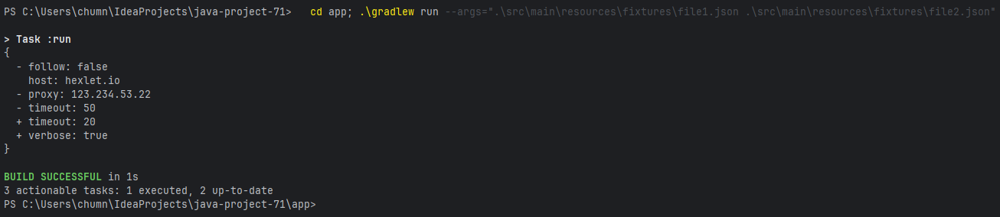
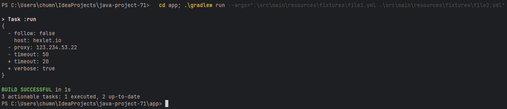
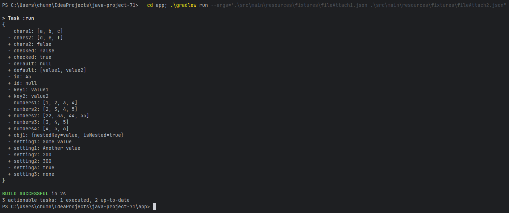
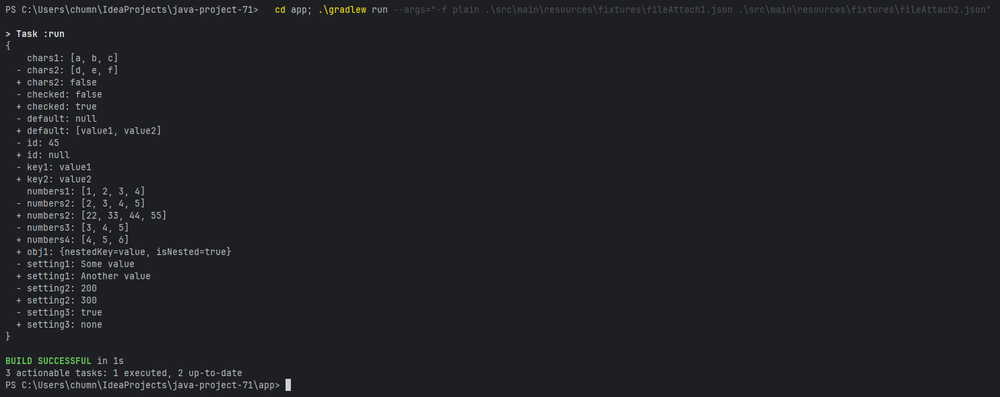
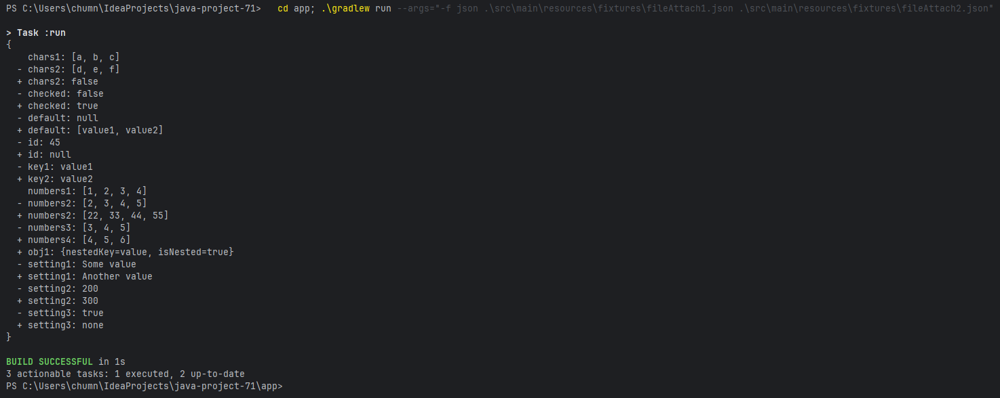

# Java Project 71

[](https://github.com/Vitaliy-Golikov/java-project-71/actions)
[](https://github.com/Vitaliy-Golikov/java-project-71/actions/workflows/main.yml)
[](https://sonarcloud.io/summary/new_code?id=Vitaliy-Golikov_java-project-71)
[](https://sonarcloud.io/summary/new_code?id=Vitaliy-Golikov_java-project-71)
[](https://sonarcloud.io/summary/new_code?id=Vitaliy-Golikov_java-project-71)
[](https://sonarcloud.io/summary/new_code?id=Vitaliy-Golikov_java-project-71)
[](https://sonarcloud.io/summary/new_code?id=Vitaliy-Golikov_java-project-71)

## Описание
Программа для сравнения двух конфигурационных файлов и вывода их различий. Поддерживает форматы JSON и YAML, а также три формата вывода: stylish, plain и json.

## Требования
- Java 21
- Gradle

## Установка и запуск
**Справка по использованию**
```bash
  cd app; .\gradlew run --args="-h"  
```
**Версия программы**
```bash
  cd app; .\gradlew run --args="-V"
```
**Запуск тестов**
```bash
  cd app; .\gradlew test  
```
 **Шаг 6: Stylish JSON**
```bash
  cd app; .\gradlew run --args=".\src\main\resources\fixtures\file1.json .\src\main\resources\fixtures\file2.json"
```
 **Шаг 8: Stylish YAML**
```bash
  cd app; .\gradlew run --args=".\src\main\resources\fixtures\file1.yml .\src\main\resources\fixtures\file2.yml"
```
**Шаг 9: Вложенные структуры (stylish)**
```bash
  cd app; .\gradlew run --args=".\src\main\resources\fixtures\fileAttach1.json .\src\main\resources\fixtures\fileAttach2.json"
```
**Шаг 10: Plain формат**
```bash
  cd app; .\gradlew run --args="-f plain .\src\main\resources\fixtures\fileAttach1.json .\src\main\resources\fixtures\fileAttach2.json"
```
**Шаг 11: JSON формат**
```bash
  cd app; .\gradlew run --args="-f json .\src\main\resources\fixtures\fileAttach1.json .\src\main\resources\fixtures\fileAttach2.json"
```


## Пример работы


## Шаг 6: Stylish JSON


---

## Шаг 8: Stylish YAML


---

## Шаг 9: Вложенные структуры (stylish)


---

## Шаг 10: Plain формат


---

## Шаг 11: JSON формат
